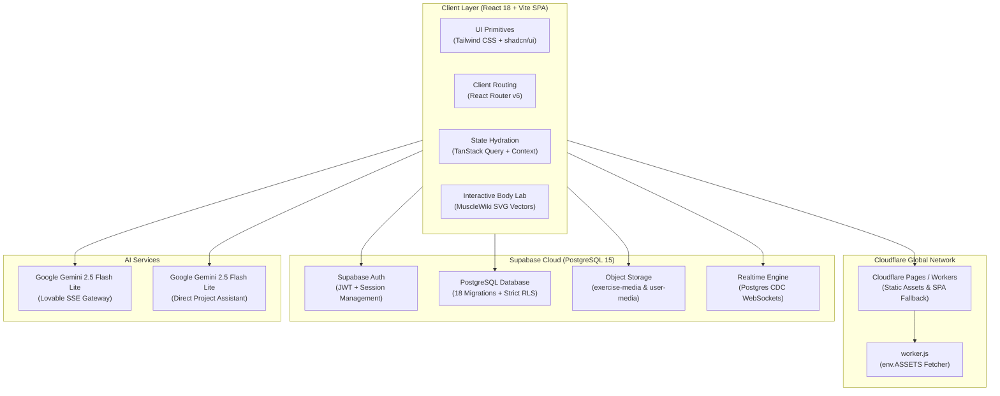

<div align="center">

# ⚡ FitBox — AI-Powered Fitness & Nutrition Ecosystem

### *An Intelligent, Biomechanically Accurate, and Culturally Rooted Health Platform*

[](https://react.dev/)
[](https://www.typescriptlang.org/)
[](https://vitejs.dev/)
[](https://tailwindcss.com/)
[](https://supabase.com/)
[](https://pages.cloudflare.com/)
[](https://deepmind.google/technologies/gemini/)
[](#-test-suites--system-verification)

<p align="center">
  <a href="#-core-pillars">Core Pillars</a> •
  <a href="#-ai-engine--assistants">AI Engine</a> •
  <a href="#-interactive-anatomy-lab">Anatomy Lab</a> •
  <a href="#-indian-nutrition-roadmap">Indian Nutrition</a> •
  <a href="#-gymbuddy-matchmaking">GymBuddy Social</a> •
  <a href="#-technical-architecture">Architecture</a> •
  <a href="#-database-migrations">Database</a> •
  <a href="#-quick-start">Quick Start</a>
</p>

---

</div>

## 📖 Executive Overview

**FitBox** is a modern, full-stack fitness and social ecosystem engineered for athletes, trainers, and fitness enthusiasts. Unifying high-performance **Google Gemini 2.5 Flash Lite** multi-assistant intelligence, a **MuscleWiki-grade 19-muscle vector anatomy map**, live set-by-set workout tracking, an **Indian-first clinical nutrition engine**, and a **gamified GymBuddy matchmaking platform**, FitBox brings elite-tier personal training directly to the browser.

Built from the ground up for speed, resilience, and offline tolerance, FitBox operates on a reactive single-page architecture deployed across **Cloudflare Pages & Workers edge networks**, with an enterprise **PostgreSQL backend** powered by **Supabase**.

---

## 🌟 Core Pillars

```
                     ┌─────────────────────────────────────────────────────────┐
                     │                       FITBOX HUB                        │
                     └────────────────────────────┬────────────────────────────┘
                                                  │
         ┌───────────────────┬────────────────────┼───────────────────┬───────────────────┐
         ▼                   ▼                    ▼                   ▼                   ▼
  🧠 Multi-Assistant    🧬 Interactive      🥗 Indian First      🤝 GymBuddy Match    📱 Edge & Mobile
   Intelligence         Anatomy Lab         Nutrition Engine      Social Network       First Design
  ─────────────────   ────────────────    ──────────────────   ──────────────────   ────────────────
   • Gemini 2.5 Coach   • 19 Vector Slugs   • Mifflin-St Jeor    • 5D Radar Synergy   • BottomTabBar
   • Project AI Vault   • Biomechanic POV   • 150+ Desi Foods    • Spring Swiping     • Safe Area Insets
   • SSE Streaming      • YouTube Library   • Cloud Sync Prefs   • Live Chat & Streaks • Zero-404 SPA
```

---

## 🤖 AI Engine & Assistants

FitBox features a sophisticated, **dual-assistant intelligence architecture** operating across distinct architectural layers with server-side credential isolation:

### 1. 🏋️ The Cloud Coach — `fitness-chat`
* **Model**: Google Gemini 2.5 Flash Lite via Lovable AI Gateway
* **Protocol**: Real-time **Server-Sent Events (SSE)** streaming token-by-token
* **Runtime**: Supabase Deno Edge Function (`supabase/functions/fitness-chat`)
* **Role**: Personalized progressive overload advice, biomechanical form correction, dynamic workout plan generation, and macro-nutrient optimization.
* **Component**: Embedded in [`GymTrainerChat.tsx`](file:///C:/Users/deepa/Downloads/musclewebsite%20test%202/art-decoder-tool/src/components/GymTrainerChat.tsx) with resilient guest fallback pathways.

### 2. 💡 The Project Assistant — `project-assistant`
* **Model**: Google Gemini 2.5 Flash Lite via Direct Google Generative Language API
* **Runtime**: Supabase Edge Function (`supabase/functions/project-assistant`)
* **Context**: Dynamically compiled from repository architecture, route manifests, environment contracts, and schema migrations (`scripts/build-project-knowledge.mjs`).
* **Component**: Mounted globally in [`ProjectAssistantChat.tsx`](file:///C:/Users/deepa/Downloads/musclewebsite%20test%202/art-decoder-tool/src/components/ProjectAssistantChat.tsx) for instant project context, architectural queries, and user guidance.

### 3. 🎯 Inspiration Archetype Classifier
* **Algorithm**: `deriveInspirationScore()` in [`src/lib/onboarding.ts`](file:///C:/Users/deepa/Downloads/musclewebsite%20test%202/art-decoder-tool/src/lib/onboarding.ts)
* **Mechanics**: Deterministically maps cultural and anime character presets (Goku, Thor, Captain America, Toji Fushiguro) along with custom tags into training archetypes:
  - 🦁 **Bulk** — Hypertrophy & high-calorie surplus
  - ⚡ **Cutting** — High-protein aggressive deficit & cardiovascular density
  - 🏃 **Athletic Performance** — Explosive power, agility, and mobility
  - 🛡️ **Strength Hybrid** — Powerlifting compound strength & density

---

## 🧬 Interactive Anatomy Lab

The center of exercise discovery is the custom-built **Vector Body Diagram**:

* **Precision Anatomical Mapping**: 19 discrete muscle zones across anterior and posterior views:
  `chest`, `upper-back`, `lower-back`, `lats`, `traps`, `shoulders`, `biceps`, `triceps`, `forearms`, `abdominals`, `obliques`, `quads`, `hamstrings`, `glutes`, `calves`, `adductors`, `abductors`, `neck`, and `full-body`.
* **MuscleWiki Synergy**: Seamless toggling between anterior/posterior views and male/female anatomical vector silhouettes.
* **Smart Equipment Filters**: Filter down instantly by Dumbbell, Barbell, Bodyweight, Cable, Machine, Kettlebell, or Resistance Bands.
* **Live YouTube Form Demonstrations**: 50+ curated exercises complete with form cues, tempo guidelines, primary/secondary targets, and integrated video players.
* **Fail-Safe Video Recovery**: Wrapped in strict React `ErrorBoundary` and inline fallback posters to guarantee uninterrupted UI navigation.

---

## 🥗 Indian Nutrition Roadmap

Clinical sports nutrition tailored specifically for Indian diets and cultural lifestyles:

* **Mifflin-St Jeor Clinical Engine**: Dynamic Basal Metabolic Rate (BMR) and Total Daily Energy Expenditure (TDEE) calculation with goal-based surplus/deficit adjustments (-500 kcal for cutting, +250/500 kcal for bulking).
* **Clinical Macro Partitioning**:
  - **Protein**: 2.2g per kg bodyweight
  - **Fats**: Exactly 25% of daily TDEE
  - **Carbohydrates**: Fills remaining energy budget (with automatic negative clamp protection)
* **150+ Indian Food Database**: Complete nutritional breakdowns (Protein, Carbs, Fats, Fiber, INR Cost Estimates, Hindi names, and Vegetarian/Vegan tags) for Paneer, Soya Chunks, Sattu, Dal, Moong Sprout, Curd, Roti, Rajma, and more.
* **5-Tab Personalized Roadmap**:
  1. ⚡ **Pre-Workout Fuel** — High GI carbs and natural pre-workout boosters
  2. 🔋 **Post-Workout Recovery** — High protein rapid repair timing
  3. 🛌 **Rest Day Nutrition** — Satiety management and recovery macros
  4. 💊 **Supplements & Desi Alternatives** — Creatine, Whey, Sattu, Chaas & Ashwagandha
  5. 🔄 **Protein Swaps** — Budget-conscious Indian protein exchange chart
* **Cross-Device Cloud Sync**: Questionnaires hydrate from and persist directly to `profiles.preferences` JSONB with malformed JSON self-healing.

---

## 🤝 GymBuddy Matchmaking & Social Layer

A social accountability platform designed to match workout partners based on actual training compatibility:

```
                           ┌───────────────────────────┐
                           │   GYMBUDDY RADAR ENGINE   │
                           └─────────────┬─────────────┘
                                         │
                 ┌───────────────────────┼───────────────────────┐
                 ▼                       ▼                       ▼
          🎯 Goals (30%)          🏋️ Split (20%)          ⏱️ Timings (20%)
         Overlapping targets      PPL / Bro / Upper-Lower  Morning / Evening sync
                 │                       │                       │
                 └───────────────────────┼───────────────────────┘
                                         │
                 ┌───────────────────────┴───────────────────────┐
                 ▼                                               ▼
          🏆 Experience (20%)                             📍 Location (10%)
         Beginner / Intermediate / Pro                    Gym & geographic proximity
```

* **Spring Physics Card Swiping**: Built with **Framer Motion** for card drag physics, rotation, and swipe dismissal.
* **Proximity Radar & Radar Polygon**: Visual synergy analysis using **Recharts Radar** showing compatibility across all 5 dimensions.
* **Scalable Anti-Join Candidate Discovery**: High-performance PostgreSQL RPC function (`get_gymbuddy_candidates`) executing an indexed anti-join against `gymbuddy_swipes` to discover candidates in constant time.
* **Instant Mutual Matching**: Atomic PostgreSQL checks enforce mutual match creation, accompanied by haptic vibration and `canvas-confetti` celebrations.
* **WebSocket Realtime Messaging**: Live chat powered by Supabase Realtime subscriptions with active live session indicators and hype micro-reactions.
* **Accountability Streaks**: Authoritative milestone notifications triggered only on legitimate, strictly increasing dual-partner session logs.

---

## 📱 Mobile-First Architecture & UI Polish

FitBox provides an app-like experience across iOS and Android browsers:

* **BottomTabBar Navigation**: 5-point fixed bottom navigation bar with responsive icons (`Dashboard`, `Exercises`, `Workout`, `GymBuddy`, `Nutrition`).
* **Safe Area Insets**: Full native iOS/Android notch and home-indicator padding (`pb-[env(safe-area-inset-bottom)]`).
* **Route Aliases**: Built-in support for short convenience route aliases (`/FORPHONE1CLAUDE`, `/exercises_m`, `/workout_m`, `/nutrition_m`, `/gymbuddy_m`).
* **Workout Session Safeguards**:
  - `isHydrated` lifecycle protection prevents state wipeouts on page refresh.
  - Interactive **Discard Workout Confirmation Dialog** prevents accidental workout cancellation.
  - Smooth string-state set logging prevents numeric input clearing glitches.
* **Auth & Security Upgrades**: Password visibility eye toggles, strict username regex, email auto-trimming, and a dedicated password recovery route (`/reset-password`).

---

## 🏗️ Technical Architecture & Stack



---

## 🗄️ Database Migrations

FitBox maintains a synchronized database schema across **18 timestamped migrations** with strict Row-Level Security (RLS):

| # | Migration File | Scope & Impact |
|:---:|:---|:---|
| **01** | `20251007065542_5c736262-….sql` | Core user profiles, phone index, workouts schema |
| **02** | `20251101134359_5da3b141-….sql` | Trainer verification & metadata structures |
| **03** | `20251101134429_3364976a-….sql` | Subscription plans, Razorpay payments, assigned trainers |
| **04** | `20251102102609_ac2dee1f-….sql` | Profile avatar URL, bio, and social attributes |
| **05** | `20251103054708_7d8f9601-….sql` | Nutrition dietary preferences & calorie targets |
| **06** | `20251104092222_cc02532f-….sql` | Profiles security policy hardening |
| **07** | `20251104092449_46219c0c-….sql` | Strict RLS permissions for public profile lookup |
| **08** | `20251107094622_51a3f036-….sql` | Auth triggers (`handle_new_user`) & automated profile generation |
| **09** | `20251225085147_ae0eeca2-….sql` | Trainer sensitive data PII vault & immutable audit logging |
| **10** | `20251225093341_a0379854-….sql` | Relational workout engine (`sessions → logs → sets`) |
| **11** | `20260326104045_create_bookings_table.sql` | Booking reservations & calendar management |
| **12** | `20260327000000_create_exercise_media_bucket.sql` | Storage bucket for exercise demo videos and posters |
| **13** | `20260427000000_gymbuddy_schema.sql` | Full GymBuddy tables: profiles, swipes, matches, messages, logs |
| **14** | `20260427000001_gymbuddy_realtime.sql` | Realtime CDC publication for matches & live session logs |
| **15** | `20260902024538_add_profiles_preferences.sql` | User preferences JSONB column for onboarding & nutrition sync |
| **16** | `20260921000000_fitbox_remediation.sql` | Phone number null safety, partial unique indexes, swipe RLS |
| **17** | `20260925000000_storage_and_realtime_remediation.sql` | `user-media` bucket, `REPLICA IDENTITY FULL`, candidate discovery RPC |
| **18** | `20260925120000_fix_gymbuddy_profiles_recursion.sql` | Non-recursive RLS policy via `is_user_discoverable` `SECURITY DEFINER` |

---

## 🧪 Test Suites & System Verification

FitBox enforces automated testing before every deployment:

```bash
# Run the core 22-suite remediation verification runner
npm test

# Run the comprehensive 31-suite full-system beta-test suite
node scripts/beta-test-suite.mjs
```

### 📊 Verification Metrics (53 Passing Suites, 0 Failures)
```
  ✅ [Auth] PASS: authSchemas: email trimming, minimum 8-char password, strict username regex
  ✅ [Auth] PASS: AuthContext: dual-identity separation & safe profile hydration
  ✅ [Auth] PASS: Auth UI: password eye visibility toggles & mode switches
  ✅ [Auth] PASS: Password Recovery: query/hash preservation & resetPasswordSchema
  ✅ [Onboarding] PASS: Inspiration Archetype Scorer: deterministically maps presets to archetypes
  ✅ [Onboarding] PASS: Onboarding Media: validates MIME types & guarantees fallback preset image
  ✅ [Anatomy] PASS: Muscle Mapping: all 19 muscle groups have canonical slugs & aliases
  ✅ [Anatomy] PASS: Exercise Database: 50+ exercises with valid target, equipment, and form
  ✅ [Workout] PASS: Workout Lifecycle: isHydrated lifecycle guard prevents refresh deletion
  ✅ [Workout] PASS: Workout Header & Discard: confirmation dialog prevents accidental loss
  ✅ [Workout] PASS: Exercise Set Logging: numeric input clearing bug resolved with string state
  ✅ [Workout] PASS: Workout Save Hook: profileId FK targeting & guest local history persistence
  ✅ [Nutrition] PASS: Macro Engine: clinical Mifflin-St Jeor formula & deficit calculations
  ✅ [Nutrition] PASS: Indian Food Database: 150+ items including oils & protein swaps
  ✅ [Nutrition] PASS: Nutrition Cloud Sync: Supabase profiles.preferences sync & error recovery
  ✅ [GymBuddy] PASS: Upfront Guest Gating: blocks unauthenticated guests before setup
  ✅ [GymBuddy] PASS: Compatibility Engine: 5 normalized dimensions matching matchmaking inputs
  ✅ [GymBuddy] PASS: Compatibility Radar: wires GymBuddyCard radar directly to canonical breakdown
  ✅ [GymBuddy] PASS: Candidate Discovery Scalability: anti-join RPC function & query bounding
  ✅ [GymBuddy] PASS: Chat Identity Model: sender_id correctly compared against authUserId
  ✅ [GymBuddy] PASS: Streak Milestone Notifications: authoritative tracking & alert delivery
  ✅ [Mobile] PASS: BottomTabBar: 5 navigation destinations with safe-area insets
  ✅ [Mobile] PASS: Header & Safe Spacing: compact mobile header & body padding
  ✅ [Mobile] PASS: Route Aliases: supports FORPHONE1CLAUDE convenience route paths
  ✅ [AI] PASS: GymTrainerChat: intentional guest pathway prevents gateway 401 crash
  ✅ [AI] PASS: Edge Functions: rate limiting, payload bounding, and Gemini 2.5 streaming
  ✅ [Database] PASS: Migrations: user-media storage bucket, REPLICA IDENTITY FULL, anti-join RPC
  ✅ [Database] PASS: Dead Code Removal: verified orphaned components deleted
  ✅ [Database] PASS: Migrations: non-recursive RLS policy via SECURITY DEFINER function
  ✅ [Build] PASS: Bundle Artifacts: dist contains index.html, assets, CSS, and split chunks
  ✅ [Build] PASS: Cloudflare Workers Builds: wrangler.toml SPA routing configured
```

---

## ⚡ Quick Start

### Prerequisites
* **Node.js**: `22.x LTS` recommended (`.node-version` & `.nvmrc` provided)
* **Package Manager**: `npm` (strictly maintained via `package-lock.json`)
* **Supabase CLI**: `2.x+`

### 1. Clone & Install
```bash
git clone https://github.com/AradhyaMalaviya/FitBox.git
cd FitBox
npm install
```

### 2. Configure Environment
Create a `.env` file in the root directory:
```env
VITE_SUPABASE_URL=https://your-project-id.supabase.co
VITE_SUPABASE_PUBLISHABLE_KEY=your-supabase-publishable-key
```

For Supabase Edge Functions, set the following secrets in your Supabase dashboard or via CLI:
```bash
supabase secrets set LOVABLE_API_KEY=your_lovable_key
supabase secrets set GEMINI_API_KEY=your_gemini_key
```

### 3. Synchronize Database Migrations
```bash
# Push all 18 database migrations to your Supabase instance
supabase db push
```

### 4. Upload Exercise Media Assets
```bash
# Requires SUPABASE_SERVICE_ROLE_KEY in env
npm run upload:exercise-media
```

### 5. Start Development Server
```bash
npm run dev
```
Visit `http://localhost:5173` to explore FitBox.

---

## 🌐 Production Deployment

### Option A: Cloudflare Pages & Workers (Recommended)
FitBox includes pre-configured [`public/_headers`](file:///C:/Users/deepa/Downloads/musclewebsite%20test%202/art-decoder-tool/public/_headers), [`wrangler.toml`](file:///C:/Users/deepa/Downloads/musclewebsite%20test%202/art-decoder-tool/wrangler.toml) (with `not_found_handling = "single-page-application"`), and [`worker.js`](file:///C:/Users/deepa/Downloads/musclewebsite%20test%202/art-decoder-tool/worker.js) for zero-configuration Cloudflare deployment:

1. Connect your repository (`AradhyaMalaviya/FitBox`) to **Cloudflare Pages** or **Cloudflare Workers**.
2. **Build Settings**:
   - **Framework Preset**: `Vite`
   - **Build Command**: `npm run build`
   - **Deploy Command**: `npx wrangler deploy`
   - **Output Directory**: `dist`
   - **Root Directory**: *Leave empty / blank* (`/`)
3. **Environment Variables**: Add `VITE_SUPABASE_URL` and `VITE_SUPABASE_PUBLISHABLE_KEY`.
4. Deploy! All client-side React routes (`/exercises`, `/gymbuddy`, `/nutrition`) will resolve with zero 404 errors.

### Option B: Local Production Build
```bash
npm run build
npm run preview
```

---

## 👨‍💻 Author & Architecture

**Aaradhya Malaviya**  
*Full-Stack Engineer & AI Systems Architect*  
* [GitHub Profile](https://github.com/AradhyaMalaviya)
* [LinkedIn](https://linkedin.com/in/aaradhyamalaviya)
* [Repository](https://github.com/AradhyaMalaviya/FitBox)

---

## 📄 License

Proprietary © 2026 Aaradhya Malaviya. All rights reserved.
